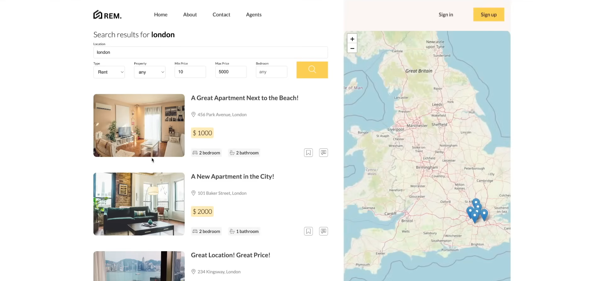
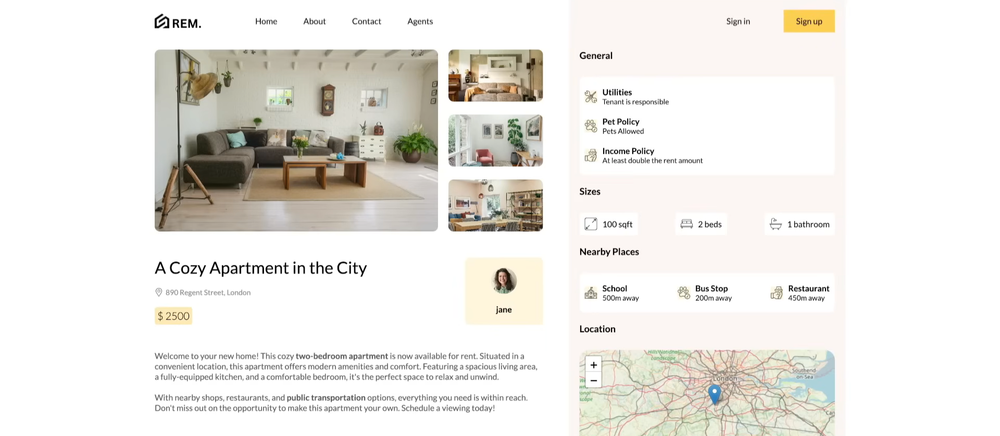

# Real Estate Marketplace

A full-stack real estate marketplace built with React, Node.js, Express.js, and MongoDB, featuring real-time chat using Socket.io. Users can browse property listings, view details, create posts, and communicate in real time.

---

## Project Images






---

## Technologies

```React.js``` ```Node.js```  ```Express.js```  ```MongoDB```  

---

## Features

- Node.js and Express backend with API routes, authentication, and database communication  
- MongoDB database managed with Prisma ORM  
- Secure authentication using JWT tokens stored in cookies with protected routes  
- React frontend with routing via React Router DOM  
- State management using Context API and Zustand  
- Create, read, update, and delete property posts  
- File uploads for property images through backend endpoints  
- Rich text editor for formatted property posts  
- Real-time chat using Socket.io with auto-scroll and seen notifications  
- Responsive layouts for all devices  
- Post filtering and dynamic fetching based on URL queries  
- Interactive UI elements enhancing user experience  

---

## Running the Project

1. Clone the repository:
   ```bash
   git clone https://github.com/ssharpalla2002/Real_Estate_Marketplace.git
   ```

2. Install backend dependencies and run the server:
   ```bash
   cd api
   npm install
   npm run dev
   ```

3. Install frontend dependencies and run the client:
   ```bash
   cd client
   npm install
   npm start
   ```

4. Open the application in your browser:
   ```
   http://localhost:3000
   ```

